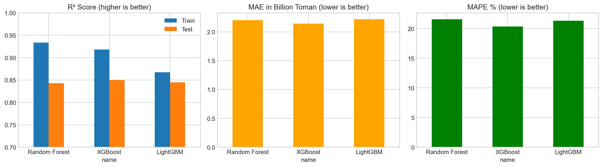

# 🏠 Tehran Real Estate Price Predictor

[](https://tehran-real-estate-predictor-ifv6i8mfgmdwz59auohcrb.streamlit.app/)

An interactive machine learning application that predicts property prices in Tehran based on location, size, amenities, and other features. Built with real data from Divar.ir (86,000+ listings).



## 🎯 Features

- **Interactive Map**: Click anywhere in Tehran to select a location
- **Smart Predictions**: XGBoost model with 85% R² accuracy
- **34 Features**: Including location, size, amenities, and NLP-extracted features from Farsi descriptions
- **Real Data**: Trained on 86,000+ real listings from 1403 (2024)

## 📊 Model Performance

| Metric | Value |
|--------|-------|
| R² Score | 85.3% |
| MAPE | 19.8% |
| CV R² | 87.7% |
| MAE | 2.1B Toman |

## 🔧 Tech Stack

- **ML**: XGBoost, Scikit-learn, LightGBM
- **Data**: Pandas, NumPy
- **Visualization**: Matplotlib, Seaborn, Folium
- **Web App**: Streamlit
- **NLP**: Persian text feature extraction

## 📁 Project Structure

```
├── app.py                          # Streamlit web application
├── tehran_price_model.pkl          # Trained XGBoost model
├── model_metadata.pkl              # Feature names and model info
├── neighborhood_stats.csv          # Neighborhood coordinates
├── tehran_properties_clean.csv     # Cleaned dataset
├── divar_analysis.ipynb            # Data cleaning notebook
├── tehran_price_model.ipynb        # Model training notebook
├── tehran_property_storytelling.ipynb  # EDA & visualization
└── requirements.txt                # Python dependencies
```

## 🚀 Run Locally

```bash
# Clone the repository
git clone https://github.com/YOUR_USERNAME/tehran-property-predictor.git
cd tehran-property-predictor

# Install dependencies
pip install -r requirements.txt

# Run the app
streamlit run app.py
```

## 📈 Key Insights

1. **Location is King**: Latitude/longitude are the most important predictors
2. **North-South Divide**: Properties in North Tehran cost 2x more than South
3. **Size Matters**: Each additional sqm adds ~85M Toman
4. **Amenities Impact**: Elevator adds ~15%, parking adds ~10%

## 📊 Data Source

- **Source**: Divar.ir real estate listings
- **Period**: Farvardin 1403 - Esfand 1403 (March 2024 - March 2025)
- **Size**: 86,434 residential property listings in Tehran

## 🤖 NLP Features Extracted

The model includes features extracted from Farsi property descriptions:
- Orientation (North/South/East/West facing)
- Luxury indicators
- Renovation status
- View availability
- And more...

## 👤 Author

**Mohammad Ashtiani**
- LinkedIn: [@mohammad-ashtiani](https://www.linkedin.com/in/mohammad-ashtiani-97769a22b/)
- GitHub: [@mokhorsandi](https://github.com/mokhorsandi)

## 📄 License

This project is open source and available under the [MIT License](LICENSE).

---

⭐ If you found this project useful, please consider giving it a star!
